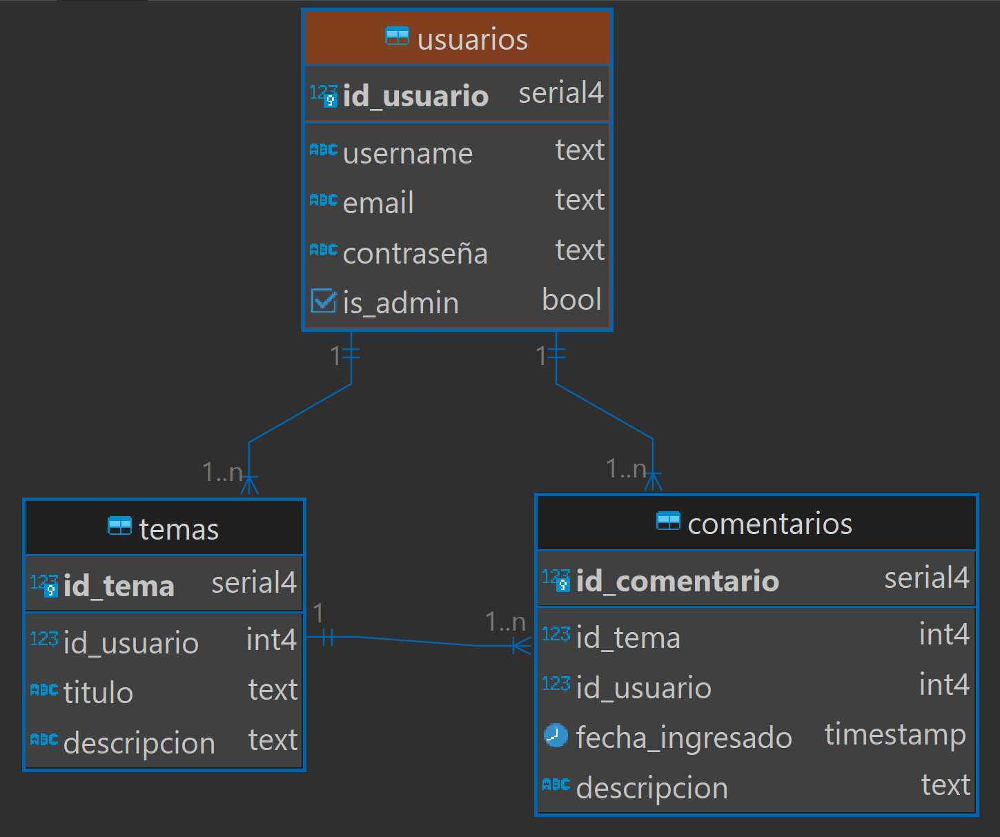

# PRIMER PARCIAL

#### Partimos de la siguiente base de datos:

#### Implementar login

- Si se loguea un admin le muestra la lista completa de temas.
- Si se loguea un no admin le muestra la lista de sus temas.
- Es necesario poder verificar el usuario logueado.

#### Implementar vista de temas

- Crear una página para mostrar los temas del usuario.
- Crear una página para mostrar todos los temas.
- No es necesario implementar creación, modificación y borrado de temas.

#### Implementar CRUD de comentarios para el modelo dado según las siguientes reglas:

- Solo el administrador puede modificar un comentario.
- Solo el creador o administrador puede borrar un comentario.

Puedes consultar la siguiente lista de cotejo por más detalles.

#

# LISTA DE COTEJO para corrección.

## FRONTEND

### Login

| Puntos | Descripción                                                                     |
| ------ | ------------------------------------------------------------------------------- |
| 10     | Como usuario puedo ingresar al sistema con mi usuario y contraseña              |
| 5      | El formulario de login despliega mensajes informativos cuando corresponde       |
| 5      | Está lindo el login                                                             |
| 10     | Como usuario puedo corroborar que el usuario actual es el mío                   |
| 5      | Como usuario puedo salir del sistema y se borran mis datos                      |
| 5      | Como usuario puedo mantener la sesión si recargo la página                      |
| 5      | Cuando el usuario se loguea redirige a la lista de temas del usuario            |
| 10     | Como administrador puedo ingresar al sistema con mi usuario y contraseña        |
| 5      | Cuando se loguea un usuario administrador redirige a la lista completa de temas |

### Temas (Solo ver)

| Puntos | Descripción                                     |
| ------ | ----------------------------------------------- |
| 10     | Como usuario puedo ver los temas creados por mí |
| 5      | Está lindo el listado de mis temas              |
| 10     | Como usuario puedo ver todos los temas          |
| 5      | Está lindo el listado completo de temas         |

### Comentarios

| Puntos | Descripción                                                     |
| ------ | --------------------------------------------------------------- |
| 10     | Como usuario puedo ver los comentarios de un tema en particular |
| 5      | Está lindo el listado de comentarios                            |
| 10     | Como usuario puedo ingresar un comentario en un tema            |
| 5      | Al ingresar un comentario hay al menos una validación           |
| 5      | Está lindo el formulario para ingresar un comentario            |
| 10     | Como usuario puedo borrar un comentario de un tema              |
| 5      | Como usuario NO puedo modificar un comentario                   |
| 10     | Como usuario administrador puedo modificar un comentario        |

## BACKEND

### Obtener comentarios

| Puntos | Descripción                                                     |
| ------ | --------------------------------------------------------------- |
| 10     | Se pueden obtener los comentarios de un tema                    |
| 5      | Se devuelve el status code correcto al devolver los comentarios |
| 5      | Se valida params al obtener los comentarios                     |
| 5      | Se valida response al obtener los comentarios                   |
| 5      | Solo se obtienen los comentarios estando autenticado            |
| 5      | La ruta y verbo para obtener comentarios es correcta            |

### Crear comentario

| Puntos | Descripción                                                 |
| ------ | ----------------------------------------------------------- |
| 10     | Se puede crear un comentario en un tema                     |
| 5      | Se devuelve el status code correcto al crear un comentario  |
| 5      | Se valida params al crear un comentario                     |
| 5      | Se valida el body al insertar un comentario                 |
| 5      | Se valida response al crear comentario                      |
| 5      | Hay que estar autenticado para poder ingresar un comentario |
| 5      | La ruta y verbo para crear comentarios es correcta          |

### Modificar comentario

| Puntos | Descripción                                                          |
| ------ | -------------------------------------------------------------------- |
| 10     | Se pueden editar un comentario en un tema                            |
| 5      | Se devuelve el status code correcto al modificar un comentario       |
| 5      | Se validan los parámetros al modificar un comentario                 |
| 5      | Se valida el body al modificar un comentario                         |
| 5      | Se valida la respuesta al modificar comentario                       |
| 5      | Hay que estar autenticado y ser administrador para poder modificarlo |
| 5      | La ruta y verbo para modificar comentarios es correcta               |

### Borrar comentario

| Puntos | Descripción                                                                                               |
| ------ | --------------------------------------------------------------------------------------------------------- |
| 10     | Se puede borrar un comentario en un tema                                                                  |
| 5      | Se devuelve el status code correcto al borrar un comentario                                               |
| 5      | Se validan los parámetros al borrar un comentario                                                         |
| 5      | Se valida la respuesta al borrar comentario                                                               |
| 5      | Hay que estar autenticado y ser el creador del comentario o administrador para poder borrar un comentario |
| 5      | La ruta y verbo para eliminar comentarios es correcta                                                     |
